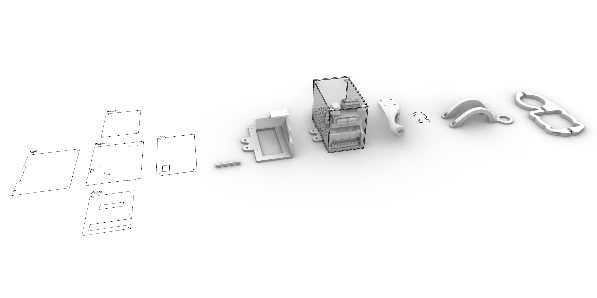
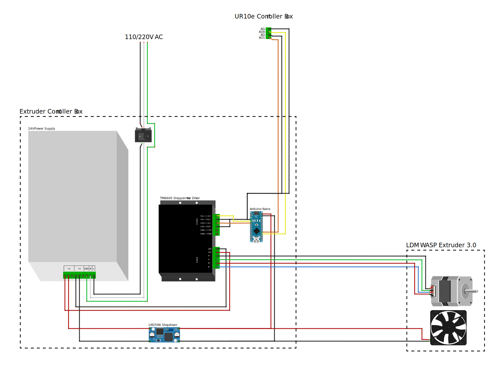

# WASP Clay Kit on UR10e
###### A controller box and mounts to get started with the WASP Clay Kit on UR10e

## Overview
This repository contains everyting needed to get started with robotic clay printing with the [WASP Clay Kit](https://www.3dwasp.shop/en/prodotto/clay-extruder-wasp-clay-kit/) and the [Universal Robot UR10e](https://www.universal-robots.com/products/ur10-robot/) (or any UR model).

Included in the repository are:

- Controller Box CAD Files: For 3D printing the structure and laser cutting the acrylic walls of the controller box,
- Mounts CAD Files: For 3d printing mounts to secure the clay tank, extruder, and pressure gauge,
- Scripts: Arduino code for the controller and Grasshopper toolpath example.

## Note on the Signal Workflow

The workflow begins with the Grasshopper script embedding the extrusion commands (rate and direction) into the URP file. This file instructs the UR10e to output two analog voltage signals (0-5V) on AO0 (Pul) and AO1 (Dir). These signals are read by the Arduino on pins A0 (Pul) and A1 (Dir), which translates them into digital signals on pins D2 (Pul) and D3 (Dir) for the stepper motor driver, ultimately driving the WASP extruder's stepper motor.

The analog signals can also be overwritten in real-time using the UR Teaching Pendant.

**Grasshopper (Extrusion Command Embeded in URP file/G-Code ) ⟶ UR10e (Analog Output 0-5V) ⟶ Arduino (Analog Input) ⟶ Stepper Motor Driver (Digital Signal) ⟶ WASP Extruder's Stepper Motor**

## Components

- Arduino Nano
- TM6600 Stepper Motor Driver
- LM2596 Stepdown reducer 24v to 12v
- Rocker Switch
- 24v Power Supply
- M3 and M4 Hex Socket Head Screws
- 3mm Acrylic Sheet
- Electrical Connectors (JST XH in our case)
- 18 and 24awg cables 

## Setup and Installation
### Prerequisites

- UR10e Robotic Arm (or any UR models),
- WASP Clay kit (WASP LDM Extruder 3.0, Clay Tank),
- Rhino Grasshopper: For generating toolpath commands.

### Wiring Diagram

Refer to the following wiring diagram for the electrical connections.

Diagram made with the open-source tool [Fritzing](https://fritzing.org/).

### CAD Files

#### Controller Box

- [Structure](Controller_Box/CAD/Print_WASP_Skeleton.stl) 3D printing file. Skeleton inside de box holding all the components in place,
- [Corner brackets](Controller_Box/CAD/Print_WASP_Corner_Bracket.stl) 3D printing file,
- [3MM acrylic wall](Controller_Box/CAD/Cut_WASP_3MM_Walls.AI) Laser cutting file.

#### Mounts
- [WASP LDM Extruder 3.0 Mount](Mounts/Print_WASP_Extruder_Mount.stl) 3D printing file,
- [Clay Tank Mount](Mounts/Print_WASP_Tank_Mount.stl) 3D printing file,
- [Pressure Gauge Mount](Mounts/Print_WASP_Gauge_Mount.stl) 3D printing file.

If customization is desired, Rhino files for each of the parts are in the repository.

### Scripts

#### [Arduino Script](Arduino/Stepper_PulseDir_WASP)

Upload the provided code to the Arduino Nano. Ensure all connections are made according to the wiring diagram.

#### [Grasshopper Definition](Grasshopper/Basic_Robotic_Extrusion_WASP.gh)

The [Robots](https://www.food4rhino.com/en/app/robots) plugin is necessary. The extrusion rate is set in RPM and is converted to steps per second with the following equation:
$$y = \left( \frac{x \times 800}{60} \right)$$
Where 800 represents the number of steps per revolution for the stepper motor, and 60 is used to convert minutes to seconds, resulting in the conversion of RPM (x) to steps per second (y).

## Pictures and Videos

https://github.com/cxlso/WASP_Clay_Kit_on_UR10e/assets/29285706/da89046f-a3ae-4ad9-899d-0b77da0f6eef

</img> </img> </img> </img> </img> </img> 

## Contributing

Contributions are welcome! Please submit a pull request or open an issue to discuss any changes or improvements.

## License

[![CC BY-NC-SA 4.0][cc-by-nc-sa-shield]][cc-by-nc-sa]

This work is licensed under a
[Creative Commons Attribution-NonCommercial-ShareAlike 4.0 International License][cc-by-nc-sa].

[![CC BY-NC-SA 4.0][cc-by-nc-sa-image]][cc-by-nc-sa]

[cc-by-nc-sa]: http://creativecommons.org/licenses/by-nc-sa/4.0/
[cc-by-nc-sa-image]: https://licensebuttons.net/l/by-nc-sa/4.0/88x31.png
[cc-by-nc-sa-shield]: https://img.shields.io/badge/License-CC%20BY--NC--SA%204.0-lightgrey.svg

## Acknowledgements

Special thanks to the teams and communities behind Rhino Grasshopper, Arduino, and Universal Robots for their support and resources.

